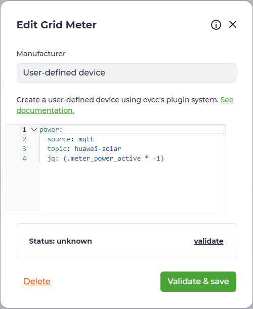
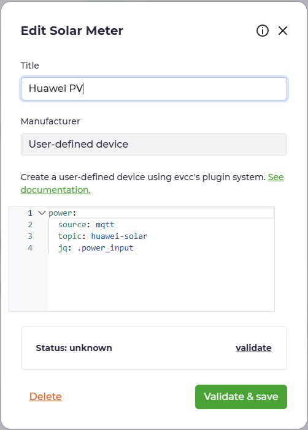
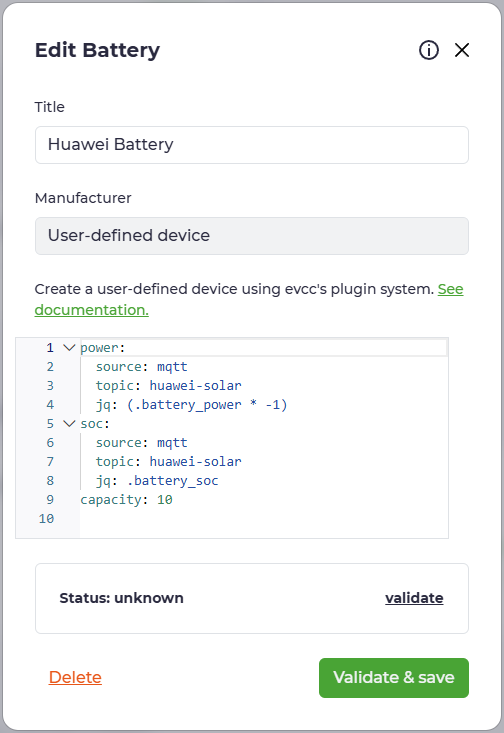

[🇬🇧 English](README.md) | 🇩🇪 **Deutsch**

### Huawei Solar Modbus zu Home Assistant via MQTT + Auto-Discovery

[](https://www.home-assistant.io/)
[](https://github.com/arboeh/huABus/releases/latest)
[](https://github.com/arboeh/huABus/actions)
[](https://codecov.io/gh/arboeh/huABus)
[](https://github.com/arboeh/huABus/blob/main/SECURITY.md)  
[](https://github.com/arboeh/huABus/graphs/commit-activity)
[](https://github.com/arboeh/huABus/blob/main/LICENSE)  
[](https://github.com/arboeh/huABus)
[](https://github.com/arboeh/huABus)
[](https://github.com/arboeh/huABus)
[](https://github.com/arboeh/huABus)
[](https://github.com/arboeh/huABus)

> **⚠️ WICHTIG: Nur EINE Modbus-Verbindung möglich**
> Huawei-Wechselrichter erlauben **nur EINE aktive Modbus TCP-Verbindung**. Dies ist ein häufiger Anfängerfehler.
>
> **Vor Installation:**
>
> - ✅ Entferne alle anderen Huawei Solar Integrationen (wlcrs/huawei_solar, HACS, etc.)
> - ✅ Deaktiviere Monitoring-Tools und Apps mit Modbus-Zugriff
> - ✅ Hinweis: FusionSolar Cloud zeigt möglicherweise "Abnormale Kommunikation" - das ist normal
>
> Mehrere Verbindungen führen zu **Timeouts und Datenverlust**!

**67 Essenzielle Registers, 69+ Entitäten, ~3-8s Laufzeit**
**Changelog:** [CHANGELOG.md](huawei_solar_modbus_mqtt/CHANGELOG.md)

## 🔌 Kompatible Wechselrichter

### ✅ Vollständig unterstützt

| Serie             | Modelle                               | Status                      |
| ----------------- | ------------------------------------- | --------------------------- |
| **SUN2000**       | 2KTL - 100KTL (alle Leistungsklassen) | ✅ **Getestet & bestätigt** |
| **SUN2000-L0/L1** | Hybrid-Serie (2-10kW)                 | ✅ Bestätigt                |
| **SUN3000**       | Alle Modelle                          | ⚠️ Kompatibel (ungetestet)  |
| **SUN5000**       | Kommerzielle Serie                    | ⚠️ Kompatibel (ungetestet)  |

### 📋 Voraussetzungen

- **Firmware:** V100R001C00SPC200+ (≈2023 oder neuer)
- **Schnittstelle:** Modbus TCP aktiviert (Port 502 oder 6607)
- **Dongle:** Smart Dongle-WLAN-FE oder SDongle A-05

### 🧪 Kompatibilitäts-Status

Hast du einen **SUN3000** oder **SUN5000** Wechselrichter? [Hilf uns beim Testen!](https://github.com/arboeh/huABus/issues/new?assignees=&labels=compatibility%2Cenhancement&template=compatibility_report.yaml&title=%5BCompatibility%5D+)

**Community-Reports:**

| Modell           | Firmware          | Status             | Melder  |
| ---------------- | ----------------- | ------------------ | ------- |
| SUN2000-10KTL-M2 | V100R001C00SPC124 | ✅ Funktioniert    | @arboeh |
| SUN2000-5KTL-L1  | V100R001C00SPC200 | ⚠️ Test ausstehend | -       |
| SUN3000-20KTL    | -                 | ❓ Ungetestet      | -       |

_Fehlende Register (Batterie/Zähler) werden automatisch behandelt - dein Wechselrichter funktioniert auch ohne alle Sensoren._

## Features

- **Automatische Slave ID-Erkennung:** Kein Raten mehr! Probiert automatisch gängige Werte (1, 2, 100)
- **Modbus TCP → MQTT:** 69+ Entitäten mit Auto-Discovery
- **Vollständiges Monitoring:** Batterie, PV (1-4), Netz (3-Phasen), Energie-Counter
- **Total Increasing Filter:** Verhindert falsche Counter-Resets in Energie-Statistiken
  - Keine Warmup-Phase - sofortiger Schutz
  - Automatischer Reset bei Verbindungsfehlern
  - Sichtbar in Logs mit 20-Cycle-Zusammenfassungen
- **Auto MQTT-Konfiguration:** Nutzt automatisch Home Assistant MQTT-Zugangsdaten
- **TRACE Log Level:** Ultra-detailliertes Debugging mit Modbus-Byte-Arrays
- **Umfassende Test-Suite:** 86% Code-Coverage mit Unit-, Integration- und E2E-Tests
- **Performance:** ~2-5s Cycle, konfigurierbares Poll-Intervall (30-60s empfohlen)
- **Error Tracking:** Intelligente Aggregation mit Downtime-Tracking
- **MQTT-Stabilität:** Connection Wait-Loop und Retry-Logik
- **Plattformübergreifend:** Alle gängigen Architekturen (aarch64, amd64, armhf, armv7, i386)

### EVCC Konfiguration (Screenshots)

**Voraussetzung:** MQTT im [evcc HA Addon](https://github.com/evcc-io/hassio-addon) aktivieren (evcc UI → Settings → MQTT).

**Netzzähler:**  


**PV-Zähler:**  


**Speicher:**  


## 🚀 Schnellstart

**Neu bei huABus?** Installation ist jetzt einfacher denn je:

1. [](https://my.home-assistant.io/redirect/supervisor_add_addon_repository/?repository_url=https%3A%2F%2Fgithub.com%2Farboeh%2FhuABus)
2. "huABus | Huawei Solar Modbus to MQTT" installieren
3. **Minimale Konfiguration:**
   ```yaml
   modbus_host: 192.168.1.100 # Deine Wechselrichter-IP
   modbus_auto_detect_slave_id: true # Automatische Erkennung
   log_level: INFO
   ```
4. Addon starten - Slave ID wird automatisch erkannt!
5. **Einstellungen → Geräte & Dienste → MQTT → "Huawei Solar Inverter"**

**Erwartete Startup-Logs:**

```
INFO - Inverter: 192.168.1.100:502 (Slave ID: auto-detect)
INFO - Trying Slave ID 1... ✅
INFO - Connected (Slave ID: 1)
INFO - Registers: 58 essential
INFO - Published - PV 4500W ...
```

**Häufige Erstinstallations-Probleme:**

| Symptom                      | Schnelle Lösung                                 |
| ---------------------------- | ----------------------------------------------- |
| Alle Slave IDs schlagen fehl | Wechselrichter-IP prüfen, Modbus TCP aktivieren |
| Keine Sensoren erscheinen    | 30s warten, MQTT-Integration aktualisieren      |
| Verbindung abgelehnt         | Modbus TCP im Wechselrichter aktiviert?         |

## Vergleich: wlcrs/huawei_solar vs. dieses Addon

Die `wlcrs/huawei_solar` ist eine **native Home Assistant Integration**, während dies ein **Home Assistant Addon** ist. Beide nutzen die gleiche `huawei-solar` Library, haben aber unterschiedliche Anwendungsfälle:

| Feature                 | wlcrs/huawei_solar<br>(Integration) | Dieses Addon<br>(MQTT-Bridge) |
| ----------------------- | ----------------------------------- | ----------------------------- |
| Installation            | Via HACS oder manuell               | Via Addon Store               |
| Batterie-Steuerung      | ✅                                  | ❌ (read-only)                |
| MQTT-nativ              | ❌                                  | ✅                            |
| Auto Slave ID-Erkennung | ❌                                  | ✅                            |
| Total Increasing Filter | ❌                                  | ✅                            |
| Externe Integrationen   | Begrenzt                            | ✅ (EVCC, Node-RED, Grafana)  |
| Zykluszeit              | Variabel                            | 2-5s                          |
| Error Tracking          | Basis                               | Advanced                      |
| Konfiguration           | UI oder YAML                        | Addon UI                      |

**Wichtig:** Beide teilen die gleiche Limitierung - nur **EINE Modbus-Verbindung**. Für gleichzeitige Nutzung wird ein Modbus Proxy benötigt.

**Wann welches nutzen?**

- **wlcrs (Integration):** Batterie-Steuerung + native HA-Integration + direkter Entitäts-Zugriff
- **Dieses Addon (MQTT-Bridge):** MQTT-Monitoring + externe System-Integration + automatische Slave ID-Erkennung + besseres Error-Tracking

## Screenshots

### Home Assistant Integration

  
_Diagnose-Entitäten mit Inverter-Status, Temperatur und Batterie-Informationen_

  
_Vollständige Sensorübersicht mit Echtzeit-Leistung, Energie und Netzdaten_

  
_MQTT-Geräteintegrations-Details_

## Konfiguration

Konfiguration über Home Assistant UI mit deutschen Feldnamen:

### Modbus-Einstellungen

- **Modbus Host:** Inverter IP-Adresse (z.B. `192.168.1.100`)
- **Modbus Port:** Standard: `502`
- **Auto-Erkennung Slave ID:** Standard: `true` (probiert automatisch 1, 2, 100)
- **Slave ID (manuell):** Nur genutzt wenn Auto-Erkennung deaktiviert (meist `1`, manchmal `0` oder `100`)

### MQTT-Einstellungen

- **MQTT Broker:** Standard: `core-mosquitto` (leer lassen für Auto-Config)
- **MQTT Port:** Standard: `1883`
- **MQTT Benutzername/Passwort:** Optional (leer lassen um HA MQTT Service-Zugangsdaten zu nutzen)
- **MQTT Topic:** Standard: `huawei-solar`

### Erweiterte Einstellungen

- **Log-Level:** `TRACE` | `DEBUG` | `INFO` (empfohlen) | `WARNING` | `ERROR`
- **Status Timeout:** Standard: `180s` (Range: 30-600)
- **Abfrageintervall:** Standard: `30s` (Range: 10-300, empfohlen: 30-60s)

**💡 Pro-Tipp:** Lass MQTT-Zugangsdaten leer - das Addon nutzt automatisch die Home Assistant MQTT Service-Einstellungen!

### MQTT Topics

- **Messdaten (JSON):** `huawei-solar` (alle Sensoren + Timestamp)
- **Status (online/offline):** `huawei-solar/status` (Availability-Topic + LWT)

### Beispiel MQTT Payload

```json
{
  "power_active": 1609,
  "power_input": 2620,
  "battery_soc": 32,
  "battery_power": 1020,
  "meter_power_active": 50,
  "voltage_grid_A": 239.3,
  "inverter_temperature": 32.4,
  "inverter_status": "On-grid",
  "model_name": "SUN2000-6KTL-M1",
  "last_update": 1768649491
  ...
  ..
  .
}
```

_Komplettes Payload-Beispiel: [mqtt_payload.json](examples/mqtt_payload.json)_

## Wichtige Entitäten

| Kategorie   | Sensoren                                                                                   |
| ----------- | ------------------------------------------------------------------------------------------ |
| **Power**   | `solar_power`, `input_power`, `grid_power`, `battery_power`, `pv1-4_power`                 |
| **Energy**  | `daily_yield`, `total_yield`\*, `grid_exported/imported`\*                                 |
| **Battery** | `battery_soc`, `charge/discharge_today`, `total_charge/discharge`\*, `bus_voltage/current` |
| **Grid**    | `voltage_phase_a/b/c`, `line_voltage_ab/bc/ca`, `frequency`                                |
| **Meter**   | `meter_power_phase_a/b/c`, `meter_current_a/b/c`, `meter_reactive_power`                   |
| **Device**  | `model_name`, `serial_number`, `efficiency`, `temperature`, `rated_power`                  |
| **Status**  | `inverter_status`, `battery_status`, `meter_status`                                        |

_\* Durch Total Increasing Filter vor falschen Counter-Resets geschützt_

## Aktuelle Updates

Siehe [CHANGELOG.md](huawei_solar_modbus_mqtt/CHANGELOG.md) für detaillierte Release-Notes.

**v1.8.0 Highlights (Feb 2026):**

- ✅ **Automatische Slave ID-Erkennung:** Kein Raten mehr - probiert automatisch 0, 1, 2, 100
- ✅ **Verbesserte MQTT Auto-Config:** Nahtlose Nutzung der HA MQTT Service-Zugangsdaten
- ✅ **Dynamische Register-Anzahl:** Startup-Logs zeigen exakte Anzahl der Register
- ✅ **Bessere Fehlermeldungen:** Klarere Anleitung bei Verbindungsproblemen

**Frühere Releases:**

- ✅ **v1.7.4:** Backup-Unterstützung gefixt, neue Modbus-Register
- ✅ **v1.7.3:** AppArmor-Sicherheitsprofil für Container-Isolation
- ✅ **v1.7.2:** Erhöhte Test-Coverage (86%)
- ✅ **v1.7.1:** Filter Restart-Schutz (keine Zero-Drops)

## Fehlerbehebung

### ⚠️ Mehrere Modbus-Verbindungen (Häufigster Fehler!)

**Symptom:** Timeouts, "No response received", intermittierende Datenverluste

**Lösung:**

1. Prüfe **Einstellungen → Geräte & Dienste** auf andere Huawei-Integrationen
2. Entferne offizielle `wlcrs/huawei_solar` und HACS-Integrationen
3. Deaktiviere Monitoring-Software von Drittanbietern
4. Hinweis: FusionSolar Cloud "Abnormale Kommunikation" ist normal

### Weitere häufige Probleme

| Problem                          | Lösung                                                                       |
| -------------------------------- | ---------------------------------------------------------------------------- |
| **Alle Slave IDs schlagen fehl** | Modbus TCP im Wechselrichter aktivieren, IP prüfen, Firewall checken         |
| **Connection Timeouts**          | Netzwerk-Latenz prüfen, poll_interval auf 60s erhöhen                        |
| **MQTT Fehler**                  | Broker auf `core-mosquitto` setzen, Credentials leer lassen                  |
| **Performance-Warnungen**        | Poll-Interval erhöhen wenn Cycle-Zeit > 80% des Intervalls                   |
| **Filter-Aktivität**             | Gelegentliches Filtern (1-2/Stunde) ist normal; häufig = Verbindungsprobleme |
| **Fehlende Sensoren**            | Normal bei Non-Hybrid oder Wechselrichtern ohne Batterie/Zähler              |

**Logs:** Addon → Huawei Solar Modbus to MQTT → Log-Tab

**Debug-Modus:** Setze `log_level: DEBUG` für detaillierte Slave ID-Erkennung und Verbindungsversuche

## 💬 Community & Support

### Hilfe bekommen

- 🐛 **[GitHub Issues](https://github.com/arboeh/huABus/issues/new/choose)** - Bugs melden oder Features vorschlagen
- 🧪 **[Compatibility Report](https://github.com/arboeh/huABus/issues/new?template=compatibility_report.yaml)** - Hilf beim Testen von SUN3000/5000 Modellen

### Community-Diskussionen

Nutzer diskutieren huABus auch in diesen Communities:

- [Home Assistant Community Forum](https://community.home-assistant.io/)

_Dies sind unabhängige Communities - für offiziellen Support bitte GitHub nutzen._

## Credits

**Basiert auf:** [mjaschen/huawei-solar-modbus-to-mqtt](https://github.com/mjaschen/huawei-solar-modbus-to-mqtt)  
**Verwendet Library:** [wlcrs/huawei-solar-lib](https://github.com/wlcrs/huawei-solar-lib)  
**Entwickelt von:** [arboeh](https://github.com/arboeh) | **Lizenz:** MIT
